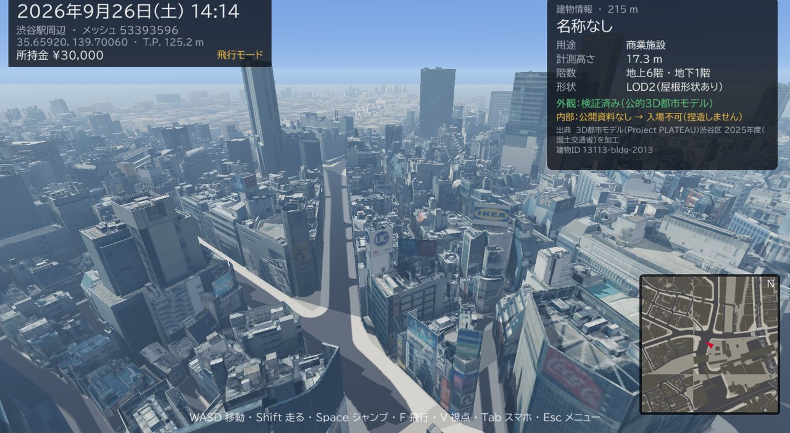
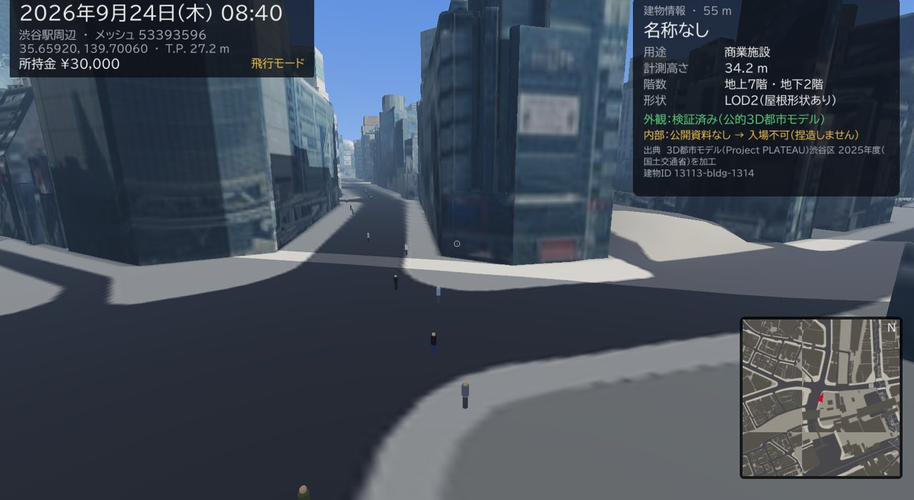
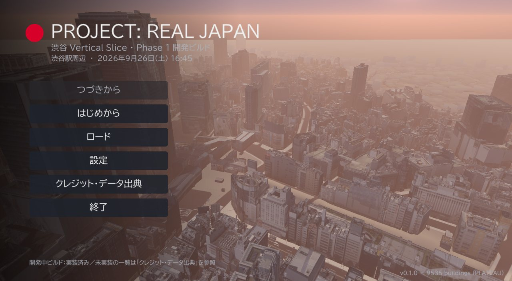
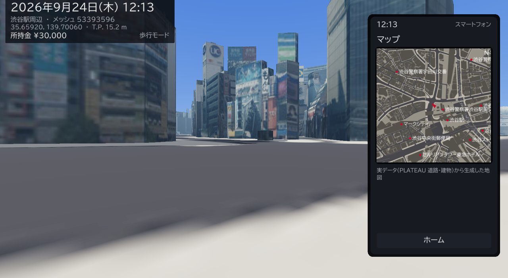

# PROJECT: REAL JAPAN

「現実世界そのものをゲームにする」——実在の日本を、公的な地理・建物データから再構築して、その中で生活できるオープンワールドゲーム。

**現在：v0.1.0 渋谷 Vertical Slice（Phase 1 開発ビルド）/ Windows 10・11 x64 ネイティブ EXE**

| | |
|---|---|
|  |  |
|  |  |

※ スクリーンショットは Windows 版 EXE を Wine＋ソフトウェア OpenGL（Mesa llvmpipe）で実行して撮影したもの。

- 国土交通省 PLATEAU（渋谷区 2025 年度）の実在建物 **9,535 棟**（LOD2 屋根形状 3,064 棟、航空写真由来の屋根・壁テクスチャ）
- PLATEAU の実在道路域（車道・歩道・中央帯）、国土地理院の標高による地形
- JGD2011 測地系・JIS 地域メッシュによる階層ストリーミングと浮動原点
- 実際の天文計算による太陽（時刻・季節で昼夜と影が変わる）、日本の祝日カレンダー
- 歩行（建物と衝突）・飛行、建物情報パネル（出典と検証状態を常に表示）
- PLATEAU 都市設備（信号・照明・柵・横断歩道・区画線）
- スマートフォン（地図・時計/日照・銀行・街の様子）
- 架空の住民 3,000 人＋域外通勤者 4,000 人の 1 日の予定。**徒歩移動中の人は実在の街路を歩く 3D 表示**（視線で名前・職業・予定を表示）
- セーブ／ロード（3 スロット＋オートセーブ）、設定ファイル、日本語／英語

**まだ無いもの**：建物内部（公開資料が無いので捏造せず入場不可）、店・仕事・車・鉄道・飛行機・船、会話、天気、音、渋谷以外。
すべての項目の正直な状況は [docs/STATUS.md](docs/STATUS.md)。

## ドキュメント

| 文書 | 内容 |
|---|---|
| [docs/ARCHITECTURE.md](docs/ARCHITECTURE.md) | 技術スタック・エンジン選定・World DB・パイプライン・ストリーミング・描画・各シミュレーション・性能予算・ロードマップ（仕様書が求める 20 項目） |
| [docs/STATUS.md](docs/STATUS.md) | 実装済み／一部／未実装の一覧、権利処理の未完了事項、既知の問題 |
| [docs/BUILD.md](docs/BUILD.md) | データ取得・クック・ビルド・Windows 配布 ZIP の作成手順 |
| [docs/sql/worlddb_schema.sql](docs/sql/worlddb_schema.sql) | 制作用 World Database（PostGIS）スキーマ案（未実行） |

## 構成

```
core/       rjcore：エンジン非依存のシミュレーションコア（C++20, テスト 48 件）
client/     ネイティブゲームクライアント（C++20 + raylib, Windows x64 / Linux）
pipeline/   実データ → ゲームデータ（PLATEAU CityGML, 国土地理院 DEM）
game/data/  言語ファイル・既定設定（街データとフォントはスクリプトで生成／取得）
packaging/  Windows 配布物の README とデータ出典
tools/      依存取得・アイコン生成・配布 ZIP 作成
```

## データ出典

- 「3D都市モデル（Project PLATEAU）渋谷区（2025年度）」（国土交通省）（https://www.geospatial.jp/ckan/dataset/plateau-13113-shibuya-ku-2025）を加工して作成
- 出典：国土地理院 標高タイル（https://maps.gsi.go.jp/development/ichiran.html）を加工して作成 ※焼き込み配布に関する測量法上の手続き要否は確認中

Google Maps / Earth 等の著作物は抽出していません。PLATEAU の写真テクスチャ（航空写真由来）には実在の看板・広告が写り込んでおり、第三者の商標・著作物の扱いは確認中です（ゲーム内の設定で写真テクスチャをオフにできます）。
